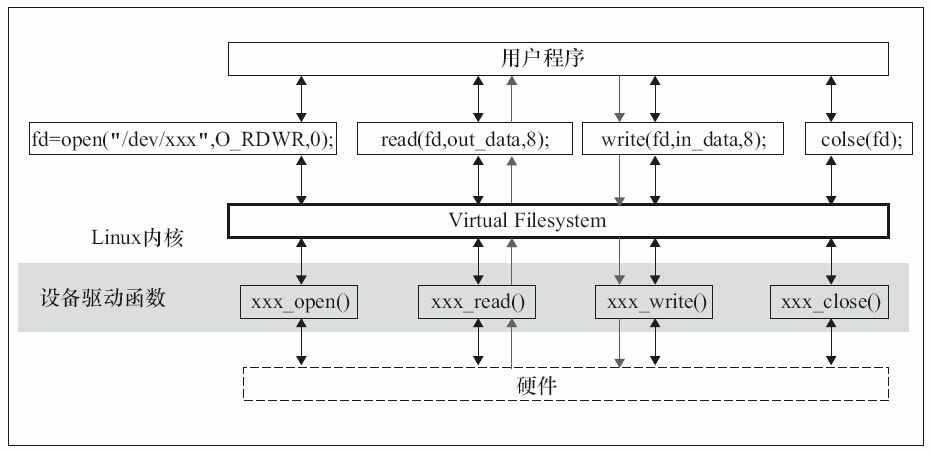
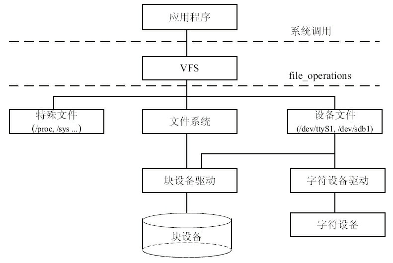
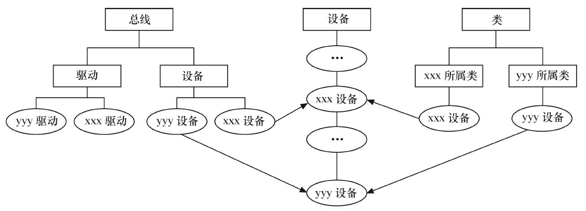

[toc]

我悔改了，之前笔记搞得和抄书一样，打字打得我人麻了，现在开始只做必要的摘抄。

# Linux文件操作

## 文件操作系统调用

编写一个程序，在当前目录下创建用户可读写文件hello.txt，其中写入“hello software weekly”，关闭文件。再次打开文件，读取内容并输出到屏幕。

```c
#include <sys/types.h>
#include <sys/stat.h>
#include <fcntl.h>
#include <stdio.h>
#define LENGTH 100
main()
{
    int fd,len;
    char str[LENGTH];
    
    fd = open("hello.txt",O_CREAT|O_RDWR,S_IRUSR|S_IWUSR)
    //open函数会返回文件描述符，对该文件的所有操作就可以通过对这个文件描述符进行操作来实现
    if (fd){
        write(fd,"Hello World",strlen("Hello World"));
        close(fd);
    }
    fd = open("hello.txt",O_RDWR);
    len = read(fd,str,LENGTH);
    str[len] = '\0';
   	printf("%s\n",str);
    close(fd);
}
```

### 文件打开标志

| 标志      | 含义                                    |
| --------- | --------------------------------------- |
| O_RDONLY  | 只读方式打开文件                        |
| O_WRONLY  | 只写方式打开                            |
| O_RDWR    | 读写方式打开                            |
| O_APPEND  | 追加方式                                |
| O_CREAT   | 创建文件                                |
| O_EXEC    | 使用了O_CREAT且文件已经存在，会发生错误 |
| O_NOBLOCK | 非阻塞方式打开                          |
| O_TRUNC   | 文件已经存在，那么删除文件内容          |

O_RDONLY、O_WRONLY、O_RDWR三个标志只能使用任意的一个。 

### 访问权限

USR结尾或U结尾是用户，GRP和G结尾是组，OTH或O结尾是其他人

IR读，IW写，IX执行，IRWX是读写执行。S_ISUID设置用户执行ID，S_ISGID设置组执行ID

## C库文件操作

C的库文件操作独立于操作系统平台。

上一个程序使用C的库函数编写：

```c
#include<stdio.h>
#define LENGTH 100
main()
{
    FILE* fd;
    char str[LENGTH];
    
    fd = fopen("hello.txt","w+");
    if (fd) {
        fputs("Hello World!",fd);
        fclose(fd);
    }
    fd = fopen("hello.txt","r");
    fgets(str,LENGTH,fd);
    printf("%s\n",str);
    fclose(fd);
}
```

# Linux文件系统

## Linux文件系统与设备驱动

应用程序与VFS（Virtual Filesystem）之间的接口是系统调用，而VFS与文件系统以及设备文件之间的接口是file_operations结构体成员函数，这个结构体包含了打开，关闭，读写，控制的一系列成员函数，关系如图。



因为字符设备的上层没有类似于磁盘的文件系统，所以字符设备的file_operations成员函数直接就由设备驱动提供，file_operations是字符设备驱动的核心。

块设备有两种访问方法

- 一种方法不通过文件系统直接访问裸设备，在Linux内核实现了统一的def_blk_fops这一file_operations，它的源代码位于fs/block_dev.c，所以当我们运行类似于`dd if=/dev/sdb1 of=sdb1.img`的命令把整个`/dev/sdb1`裸分区复制到sdb1.img的时候，内核走的是def_blk_fops这个file_operations

- 另一种方法是通过文件系统访问块设备，file_operations实现则位于文件系统内，文件系统会把针对文件的读写转换为针对块设备原始扇区的读写。



ext2, fat, Btrfs等文件系统中会实现针对VFS的file_operations成员函数，设备驱动层将看不到file_operations的存在

## file结构体

file结构体代表了一个打开的文件，每个打开的文件在内核空间都有一个关联的struct file（由内核在打开文件时创建），并传递给文件上进行操作的任何函数。在文件的所有实例关闭后，内核释放该数据结构。在内核和驱动源代码中，struct file的指针通常被命名为file或filp。

包含不限于：

- file_operations *f_op	(文件关联的操作)
- int f_flags	(文件标志如O_RDONLY等)
- fmode_t fmode	(文件读/写模式，FMODE_READ和FMODE_WRTIE)
- loff_t fpos 	(当前读写位置)
- void *private_data	(文件私有位置)

文件读/写模式mode、标志f_flags都是设备驱动关心的内容，而私有数据指针private_data在设备驱动中被广泛应用，大多被指向设备驱动自定义以用于描述设备的结构体。

```c
//判断是否阻塞方式打开设备文件
if (file->f_flags & O_NONBLOCK) 	/* 非阻塞 */
    pr_debug("open: non-blocking\n");
else 								/* 阻塞 */
    pr_debug("open: blocking\n");
```

## inode结构体（文件节点）

VFS inode包含文件访问权限，属主，组，大小，生成时间，访问时间，最后修改时间等信息。Linux**管理文件系统的最基本单元**，也是文件系统连接任何子目录，文件的桥梁。

对于表示设备文件的inode结构，i_rdev字段包含设备编号。Linux内核设备编号分为主设备编号和次设备编号，前者为dev_t的高12位，后者为dev_t的低20位。下列操作用于从一个inode中获得主设备号和次设备号

```c
unsigned int iminor(struct inode *inode);
unsigned int imajor(struct inode *inode);
```

**查看`/proc/devices`文件可以获知系统中注册的设备**，第1列为主设备号，第2列为设备名.

主设备号是与驱动对应的概念，同一类设备一般使用相同的主设备号，不同类的设备一般使用不同的 主设备号（但是也不排除在同一主设备号下包含有一定差异的设备）。因为同一驱动可支持多个同类设 备，因此用次设备号来描述使用该驱动的设备的序号，序号一般从0开始。 

# devfs

devfs（设备文件系统）在Linux2.4内核引入，使得设备驱动程序能够自主地管理自己的设备文件。

- 可以通过程序在设备初始化时在/dev目录下创建设备文件，卸载时删除
- 设备驱动程序可以指定设备名，所有者和权限位，用户空间仍可以修改所有者和权限位
- 不再需要为设备驱动程序分配主设备号及处理次设备号，在程序中可以直接给register_chrdev()传递0主设备号以获得可用主设备号，在devfs_register中指定次设备号。

## 范例

```c
static devfs_handle_t devfs_handle;
static int __init xxx_init(void)
{
    int ret;
    int i;
    /*内核中注册设备*/
    ret = register_chrdev(XXX_MAJOR,DEVICE_NAME,&xxx_fops);
    if(ret<0){
        printk(DEVICE_NAME " can't register major number\n");
        return ret;
    }
    /* 创建设备文件 API在2.6以后被删除 */
    devfs_handle = devfs_register(NULL,DEVICE_NAME,DEVFS_FL_DEFAULT,
	XXX_MAJOR,0,S_IFCHR|S_IRUSR|S_IWUSR,&xxx_fops,NULL);
    //...
    printk(DEVICE_NAME " initialized\n");
    return 0;
}

static void __exit xxx_exit(void){
    devfs_unregister(devfs_handle); /* 撤销设备文件 API在2.6以后被删除 */
    unregister_chrdev(XXX_MAJOR, DEVICE_NAME); /* 注销设备 */
}

module_init(xxx_init);
module_exit(xxx_exit);
```

# udev用户空间设备管理

devfs和udev分别是Linux 2.4和Linux 2.6以后的内核生成设备文件节点的方法，前者运行于内核空间，后者运行于用户空间

## udev和devfs

尽管devfs有这样和那样的优点，但是，在Linux 2.6内核中，devfs被认为是过时的方法，并最终被抛弃了，udev取代了它。Linux VFS内核维护者Al Viro指出了几点udev取代devfs的原因： 

- devfs所做的工作被确信可以在用户态完成
- devfs有无法修复的bug，维护者和作者已经停止了维护工作

udev完全在用户态工作，利用设备加入或移除时内核所发送的热插拔事件（Hotplug Event）来工作。 在热插拔时，设备的详细信息会由内核通过netlink套接字发送出来，发出的事情叫uevent。udev的设备命名策略、权限控制和事件处理都是在用户态下完成的，它利用从内核收到的信息来进行创建设备文件节点等工作。样例代码见书代码清单5.6

对于冷插拔的设备，Linux内核提供了sysfs下面一个uevent节点，可以往该节点写一个“add”，导致内核重新发送netlink，之后udev就可以收到冷插拔的netlink消息了。

## 使用范例

```c
#include <linux/netlink.h>
#include <sys/poll.h>
#include <sys/socket.h>
#include <string.h>
#include <stdio.h>
#include <stdlib.h>

/*
 *这个头文件真tm震撼我一整年
 *命名netlink里面有宏定义但是非要我去include sys/poll 和 sys/socket
 */

static void die(char*s)
{
	write(2,s,strlen(s));
	exit(1);
}

int main(int argc,char *argv[])
{
	struct sockaddr_nl nls;
	struct pollfd pfd;
	char buf[512];
	
	memset(&nls, 0, sizeof(struct sockaddr_nl));
	nls.nl_family = AF_NETLINK;
	nls.nl_pid = getpid();
	nls.nl_groups = -1;

	pfd.events = POLLIN;
	pfd.fd = socket(PF_NETLINK, SOCK_DGRAM, NETLINK_KOBJECT_UEVENT);
	if (pfd.fd == -1){
		die("Not root\n");
	}

	if(bind(pfd.fd,(void *)&nls, sizeof(struct sockaddr_nl)))
		die("Bind failed\n");
	while(-1 != poll(&pfd, 1, -1)){
		int i, len = recv(pfd.fd, buf, sizeof(buf), MSG_DONTWAIT);
		if(len == -1)
			die("recv\n");
		

		i = 0;
		while(i < len){
			printf("%s\n", buf + i);
			i += strlen(buf+i)+1;
		}
	}
	die("poll\n");
    
    //shut up GCC !
	return 0;
}
```

udev的设计者认为devfs所提供的打开/dev节点时自动加载驱动的功能对一个配置正确的计算机来说是多余的。系统中所有的设备都应该产生热插拔事件并加载恰当的驱动，而udev能注意到这点并且为它创建对应的设备节点。

## sysfs文件系统与Linux设备模型

Linux 2.6以后内核引入了sysfs文件系统，sysfs被看成与proc, devfs和devpty同类别的文件系统。这是一个虚拟的文件系统，与提供进程和状态信息的proc文件系统十分类似。

sysfs的一个目的就是展示设备驱动模型中各组件的层次关系，其顶级目录包括block、bus、dev、devices、class、fs、kernel、power和firmware等。

- block目录包含所有的块设备；
- devices目录包含系统所有的设备，并根据设备挂接的总线类型组织成层次结构；
- bus目录包含系统中所有的总线类型；
- class目录包含系统中的设备类型（如网卡设备、声卡设备、输入设备等）。



内核的总线和其他内核子系统会完成与设备模型的交互，这使得驱动工程师只需要根据框架要求填充xxx_driver的回调函数，xxx是总线的名字。

在Linux内核中，分别使用bus_type、device_driver和device来描述总线、驱动和设备，这3个结构体定义于内核源代码的include/linux/device.h头文件中。

device_driver和device分别表示驱动和设备，而这两者都必须依附于一种总线，因此都包含struct bus_type指针。在Linux内核中，设备和驱动是分开注册的，注册1个设备的时候，并不需要驱动已经存在，而1个驱动被注册的时候，也不需要对应的设备已经被注册。bus_type的match函数将会匹配设备和驱动。

>  总线、驱动和设备最终都会落实为sysfs中的1个目录，因为进一步追踪代码会发现，它们实际上都可以认为是kobject的派生类，kobject可看作是所有总线、设备和驱动的抽象基类，1个kobject对应sysfs中的1个目录
>
> 总线、设备和驱动中的各个attribute则直接落实为sysfs中的1个文件，attribute会伴随着show() 和  store()这两个函数，分别用于读写该attribute对应的sysfs文件

## udev组成

udev的工作过程如下：

​	1）当内核检测到系统中出现了新设备后，内核会通过netlink套接字发送uevent。 

​	2）udev获取内核发送的信息，进行规则的匹配。匹配的事物包括SUBSYSTEM、ACTION、atttribute、内核提供的名称（通过KERNEL=）以及其他的环境变量

