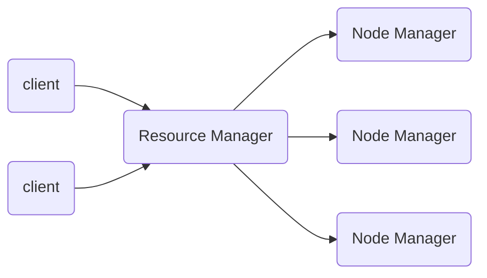
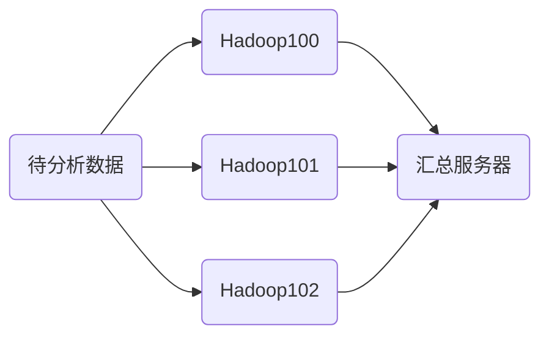
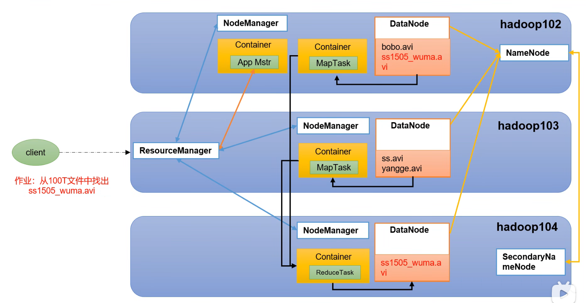
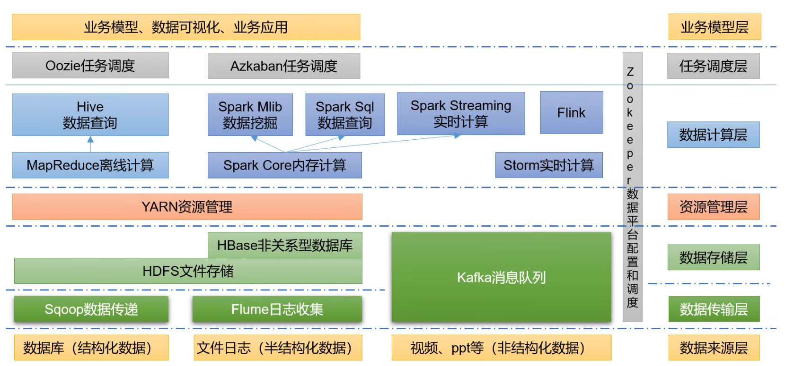
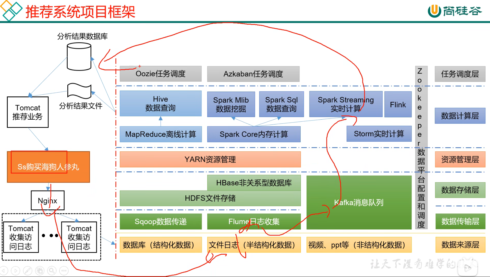

[toc]
# HDFS架构

HDFS(Hadoop Distributed File System)分为NameNOde（数据存储位置），DataNode（具体存储数据），2NN.

- NameNode(NN):存储文件的元数据，如文件名，文件目录结构，文件属性（生成时间、副本数、文件权限）以及每个文件的块列表和块所在的DataNode等。
- DataNode(DN):在本地文件系统存储文件快数据，以及块数据校验和。
- SecondaryNameNode(2NN):定期备份NN的元数据

# YARN架构
- ResourceManager(RM)：整个集群资源（内存、CPU等）的管理器
- NodeManager(NM)：单个节点服务器资源管理器
- ApplicationMaster(AM)：单个任务运行管理器
- Container：容器，相当于一台虚拟机，封装了任务运行所需要的资源

NodeManager其中包含了Container，Container可以跨NodeManager部署任务。NodeManager可以有多个Container。

# MapReduce
MapReduce分为Map和Reduce两个阶段。
- Map阶段并行处理输入数据
- Reduce阶段对Map结果进行汇总

# HDFS、YARN、MapReduce三者关系

# 大数据技术生态体系

- Sqoop: 开源工具，主要用于再Hadoop、Hive与传统数据库（MySQL)间进行数据传递，可以将一个关系型数据库中的数据导进Hadoop的HDFS中，也可以将HDFS的数据导进关系型数据中；
- Flume：高可用，高可靠的，分布式的海量日志采集、聚合和传输的系统，Flume支持在日志系统中定制各类数据发送方，由于收集数据；
- Kafka：高吞吐的分布式发布订阅消息系统；
- Spark：最流行的开源大数据内存计算框架。可以基于Hadoop上存储的大数据进行计算；
- Flink：是当前最流行的开源大数据内存计算框架。用于实时计算的场景较多；
- Oozie：管理Hadoop作业的调度系统；
- Hbase：分布式，面向列的开源数据库，不是一般的关系型数据库，适用于非结构化数据存储；
- Hive：基于Hadoop的数据仓库工具，可以将结构化数据文件映射为数据库表并提供SQL查询功能，可以将SQL语句转化为MapReduce任务进行运行，优点是学习成本低，快速简单实现MapReduce统计；
- ZooKeeper：它是一个针对大型分布式系统的可靠协调系统，功能包括：配置维护、名字服务、分布式同步、组服务等。

## 项目框架

