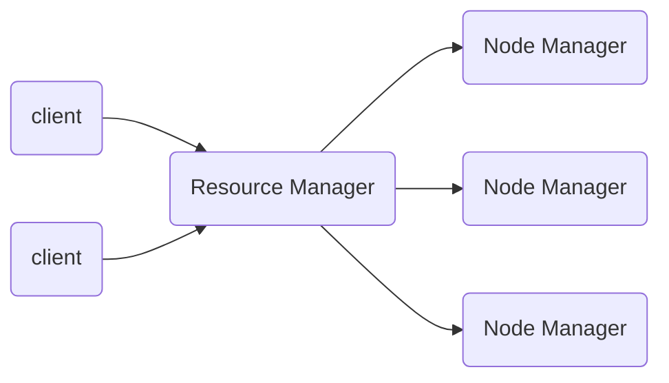

[toc]
# HDFS架构

HDFS(Hadoop Distributed File System)分为NameNOde（数据存储位置），DataNode（具体存储数据），2NN.

- NameNode(NN):存储文件的元数据，如文件名，文件目录结构，文件属性（生成时间、副本数、文件权限）以及每个文件的块列表和块所在的DataNode等。
- DataNode(DN):在本地文件系统存储文件快数据，以及块数据校验和。
- SecondaryNameNode(2NN):定期备份NN的元数据

# YARN架构
- ResourceManager(RM)：整个集群资源（内存、CPU等）的管理器
- NodeManager(NM)：单个节点服务器资源管理器
- ApplicationMaster(AM)：单个任务运行管理器
- Container：容器，相当于一台虚拟机，封装了任务运行所需要的资源

