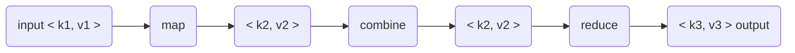

[toc]
# 概述
分布式运算程序的编程框架，让用户开发基于Hadoop的数据分析应用。将用户编写的业务逻辑代码和自带默认组件整合成完整的分布式运算程序，并发运行在Hadoop集群上。
## 优势
### 易于编程
只关心业务逻辑，实现框架的接口
### 良好的扩展性
可以动态增加服务器，扩展计算资源
### 高容错
任何一台机器失效，可以转移到其他节点。
### 海量数据计算（TB/PB）
数千台服务器同时计算
## 劣势
### 不擅长实时计算
应该使用Mysql
### 不擅长流式计算
应该使用Sparkstreaming Flink
### 不擅长DAG有向无环图计算
应该使用Spark
## MapReduce进程
- MrAppMaster：负责整个程序的过程调度及状态协调
- MapTask：负责Map阶段的整个数据处理流程
- ReduceTask：负责Reduce阶段的数据处理流程
  
# 编程规范
## 概述

## Mapper
- 用户定义的Mapper要继承父类
- Mapper输入数据是KV对形式（KV的类型可自定义）
- Mapper业务逻辑写在map方法中
- Mapper的输出数据是KV对的形式（KV的类型可自定义）
- map方法对每个<K,V>调用一次

## Reducer
- 用户自定义的Reducer要继承父类
- Reducer的输入数据类型对应Mapper的输出数据类型，也是KV
- Reducer的业务逻辑写在reduce方法中
- ReduceTask进程对每一组相同k的<k,v>组调用一次reduce方法

## Driver
相当于YARN集群的客户端，用于提交我们整个程序到YARN集群，提交的是封装了MapReduce程序相关运行参数的job对象。

## 案例
### 输入和输出
MapReduce架构基于键值对操作，也就是说，该框架将输入视为键值对并产生键值对作为输出。键值类需要被框架序列化，因此需要实现Writable接口。此外键类需要实现WritableComparable接口以方便框架进行排序。


### 代码
单词计数程序是一个简单的计算程程序，运行在本地单机/伪分布式或完全分布式Hadoop集群上。
```java
import java.io.IOException;
import java.util.StringTokenizer;

import org.apache.hadoop.conf.Configuration;
import org.apache.hadoop.fs.Path;
import org.apache.hadoop.io.IntWritable;
import org.apache.hadoop.io.Text;
import org.apache.hadoop.mapreduce.Job;
import org.apache.hadoop.mapreduce.Mapper;
import org.apache.hadoop.mapreduce.Reducer;
import org.apache.hadoop.mapreduce.lib.input.FileInputFormat;
import org.apache.hadoop.mapreduce.lib.output.FileOutputFormat;

public class WordCount {

  public static class TokenizerMapper
       extends Mapper<Object, Text, Text, IntWritable>{

    private final static IntWritable one = new IntWritable(1);
    private Text word = new Text();

    public void map(Object key, Text value, Context context
                    ) throws IOException, InterruptedException {
      // 通过StringTokenizer将行分割为词向量，然后将词向量作为键值对发出
      StringTokenizer itr = new StringTokenizer(value.toString());
      while (itr.hasMoreTokens()) {
        word.set(itr.nextToken());
        context.write(word, one);
      }
    }
  }

  public static class IntSumReducer
       extends Reducer<Text,IntWritable,Text,IntWritable> {
    private IntWritable result = new IntWritable();

    public void reduce(Text key, Iterable<IntWritable> values,
                       Context context
                       ) throws IOException, InterruptedException {
      int sum = 0;
      // 计数对应Key对应的value和
      for (IntWritable val : values) {
        sum += val.get();
      }
      result.set(sum);
      context.write(key, result);
    }
  }
  //Main 方法指定作业的各个方面，例如 Job 中的输入/输出路径(通过命令行传递)、键/值类型、输入/输出格式等。
  //然后调用 job.waitForCompletion 提交作业并监视其进度。
  public static void main(String[] args) throws Exception {
    Configuration conf = new Configuration();
    Job job = Job.getInstance(conf, "word count");
    job.setJarByClass(WordCount.class);
    job.setMapperClass(TokenizerMapper.class);
    //指定一个combiner，对键进行排序后，每个map的输出通过本地combiner（与作业配置中的Reducer相同）进行本地聚合
    job.setCombinerClass(IntSumReducer.class);
    job.setReducerClass(IntSumReducer.class);
    job.setOutputKeyClass(Text.class);
    job.setOutputValueClass(IntWritable.class);
    FileInputFormat.addInputPath(job, new Path(args[0]));
    FileOutputFormat.setOutputPath(job, new Path(args[1]));
    System.exit(job.waitForCompletion(true) ? 0 : 1);
  }
}
```
### 使用
假设环境变量如下
```shell
export JAVA_HOME=/usr/java/default
export PATH=${JAVA_HOME}/bin:${PATH}
export HADOOP_CLASSPATH=${JAVA_HOME}/lib/tools.jar
```
编译Wordcount.java并创建jar包:
```shell
$ bin/hadoop com.sun.tools.java.Main Wordcount.java
$ jar cf wc.jar WordCount*.class
```
输入输出目录假设如下
- 输入文件：/user/eddie/wordcount/input
- 输出文件：/user/eddie/wordcount/output

样例输入文件：
```shell
$ bin/hadoop fs -cat /user/eddie/wordcount/input/file01
Hello World Bye World
$ bin/hadoop fs -cat /user/eddie/wordcount/input/file02
Hello Hadoop Goodbye Hadoop
```
运行程序：
```shell
$ bin/hadoop jar wc.jar WordCount /user/eddie/wordcount/input /user/eddie/wordcount/output
```
应用程序可以使用选项-files指定一个逗号分隔的路径列表，该列表将存在于任务的当前工作目录中。

选项-libjars允许应用程序将jars添加到map和reduce的classpaths中。

选项-archives允许他们传递逗号分隔的压缩包列表作为参数。这些压缩包将被解压，并在任务的当前工作目录中创建一个带有压缩包名称的链接。

`bin/hadoop jar hadoop-mapreduce-examples-<ver>.jar wordcount -files cachefile.txt -libjars mylib.jar -archives myarchive.zip input output`

在这里，myarchive.zip将会被解压到目录并命名为"myarchive.zip"。用户也可以用`#`给文件和压缩包指定不同的符号名称。

`bin/hadoop jar hadoop-mapreduce-examples-<ver>.jar wordcount -files dir1/dict.txt#dict1,dir2/dict.txt#dict2 -archives mytar.tgz#tgzdir input output`

在这里，文件dir1/dict.txt和dir2/dict.txt能够倍任务通过符号名称dict1和dict2访问。压缩包mytar.tgz将会被解压到目录并命名为tgzdir。

可以通过命令行选项-Dmapreduce.map.env,-Dmapreduce.reduce.env和-Dyarn.app.mapreduce.am.env来改变mapper，reducer和application master的环境变量。下列环境设置将mappers和reducers的环境变量设置为FOO_VAR=bar和LIST_VAR=a,b,c。

`bin/hadoop jar hadoop-mapreduce-examples-<ver>.jar wordcount -Dmapreduce.map.env.FOO_VAR=bar -Dmapreduce.map.env.LIST_VAR=a,b,c -Dmapreduce.reduce.env.FOO_VAR=bar -Dmapreduce.reduce.env.LIST_VAR=a,b,c input output`

