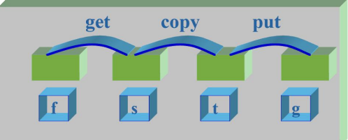

[toc]

# 简答

## 如果系统中有N个进程，那么运行进程最多几个，最少几个？就绪进程最多几个，最少几个？等待进程最多几个，最少几个？

对于N个进程，运行进程最多1个，最少0个。

就绪进程最多N-1个，最少0个。

等待进程最多N个，最少0个。

## 进程有无如下转换状态，为什么？

### （1）等待 —— 运行

没有等待——运行的转换状态，等到到运行需要经过就绪态，没有从等待到运行态的直接转换。

### （2）就绪——等待

没有就绪——等待的转换状态，只有进程在运行态等待使用资源或某个事件发生才会进入到等待态，不能直接从就绪态进入等待态。

## 用P.V操作解决同步问题



```c
semaphore f_full = f, f_empty = 0;
semaphore s_full = 0, s_empty = s;
semaphore t_full = 0, t_empty = t;
semaphore g_full = 0, g_empty = g;

void get(){
    while(true){
        P(f_full);
        V(f_empty);
        
        P(s_empty);
        V(s_full);
    }
}
void copy(){
    while(true){
        P(s_full);
        V(s_empty);
            
        P(t_empty);
        V(t_full);
    }
}
void put(){
    while(true){
        P(t_full);
        V(t_empty);
        
        P(g_empty);
        V(g_full);
    }
}
```


## 从动态性、并发性、独立性和异步性上比较进程和程序

**动态性**：进程是程序在处理器上的一次执行过程，表现为由创建而产生，由调度而执行，因得不到资源而暂停执行，由撤销而消亡。进程存在生命周期，而程序是指令集合，是一个静态的实体。

**并发性**：并发性是指多个进程同时存在于内存中，能在一段时间内同时运行。引入进程的目的是使程序与其他程序并发执行，提高资源利用率。

**独立性**：进程是一个能独立运行的基本单位，也是系统进行资源分配和调度的独立单位。未建立进程的程序，不能作为独立单位参加运行，故程序没有独立性。

**异步性**：进程以各自独立的、不可预知的速度向前推进。程序没有这一特点。

## 为什么进程在进入临界区之前应先执行“进入区”代码？而在退出前又要执行“退出区”代码？请说明原因

为了实现多个进程对临界资源的互斥访问，必须在临界区之前执行“进入区”代码，以期检查临界资源是否正在被访问，如果被访问则阻止进程进入临界区访问临界资源。

在访问完临界资源后，需要执行“退出区”代码，这样才能让其他进程恢复对临界资源的访问，若不执行“退出区”代码，那么其他进程将无法访问该临界资源。

## 设P、Q、R共享一个缓冲区，P、Q构成一堆生产者和消费者，R既为生产者又为消费者，使用P、V操作实现三个进程同步

因为有互斥操作，所以需要互斥量。

```c
semaphore full=0,empty=n,mutex=1;
void P(){
    while(true){
        P(empty);
        P(mutex);
        // 临界区 生产
        V(mutex);
        V(full);
    }
}
void Q(){
    while(true){
        P(full);
        P(mutex);
        // 临界区 消费
        V(mutex);
        V(empty);
    }
}
void R(){
    while(true){
        if(empty){
            P(empty);
            P(mutex);
            // 临界区 生产
            V(mutex);
            V(full);
        }else{
            P(full);
            P(mutex);
            // 临界区 消费
            V(mutex);
            P(empty);
        }
    }
}
```

