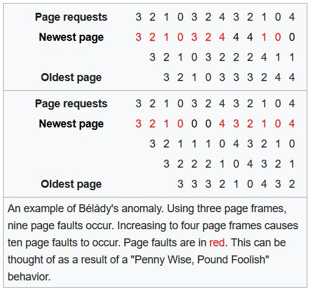

[toc]

为了让不同应用程序能够既高效又安全地共同使用物理内存资源，现代操作系统加入了一个新的抽象：虚拟内存（virtual memory）。

应用程序面向虚拟内存编写，CPU将虚拟地址翻译成物理地址，操作系统负责虚拟地址和物理地址之间的映射。每个应用程序只能能看到自己的虚拟地址空间，从而保证不同应用程序所用内存之间的隔离。

虚拟内存设计有三个方面的目标：

- 高效性：虚拟内存不能在应用程序运行过程中造成明显性能开销；另外，虚拟内存抽象不应该占用过多物理内存资源
- 安全性：虚拟内存抽象需要使用不同应用程序的内存相互隔离，即一个应用程序只能访问属于自己的物理内存区域
- 透明性：虚拟内存抽象需要考虑到对应用程序的透明性，使得应用程序开发者在编程时无需考虑虚拟内存抽象

# 虚拟地址和物理地址

## 什么是物理地址和虚拟地址？

 物理内存中的每一个字节都存在对应的地址进行访问，这被称为物理地址。

应用程序使用虚拟地址访问存储在内存中的数据和代码。

## 什么是地址翻译？

虚拟地址通过MMU（内存管理单元）转换为物理地址的过程称为地址翻译。

## 地址翻译的主要机制有哪些？

地址翻译的主要机制有：

- **分段**机制

  操作系统以段（连续的物理内存）的形式管理/分配物理内存。应用程序的虚拟地址空间由若干个不同大小的段组成，如代码段，数据段。当CPU访问其中某个段的时候，MMU通过查询段表（含段起始地址和段长）得到该段对应的物理内存区域。

  - 段号

    标识虚拟地址属于整个虚拟地址空间的哪一段

  - 段内地址

    也称为段内偏移，相对于该段起始地址的偏移量

  翻译过程中，MMU通过段表基址寄存器找到段表位置，结合段号找到段表中对应段信息，取出该段起始地址（物理地址）加上虚拟地址内的段内地址（偏移）得到最终的物理地址。

  这种方式导致物理内存出现**外部碎片**即段与段之间留下碎片（不足以映射给虚拟地址空间的段）。就比如应用程序需要2G物理空间，但是如果物理内存不存在2GB的连续空间，那么就无法正常分配。

- **分页**机制

  这是目前广泛采用的机制。将应用程序的虚拟地址空间划分成连续的等长的虚拟页，同时物理内存也被划分为连续的等长的物理页。虚拟页和物理页的页长固定且相等，使得操作系统能为每个应用程序构造**页表**（虚拟页到物理页的映射关系表）。虚拟地址也有两部分组成：

  - 虚拟页号
  - 页内偏移量

  分页机制下，应用程序虚拟地址空间中的任意虚拟页可以被映射到物理内存中的任意物理页上，因此操作系统也能实现物理内存资源的离散分配，易于管理且避免**外部碎片**。

# 基于分页的虚拟内存

## 为什么需要多级页表？

对于一个64位系统，假设每个页大小为4KB，页表中每个项大小为8字节（储存物理地址），那么页表大小为2\^64/4KB*8B，即33554432GB，为了压缩页表的大小，所以引入了多级结构的页表以**满足虚拟内存在空间高效性方面的要求**。

虚拟地址依然包括页号和页内偏移量，但是页号被划分为k个部分，任意一级某一条目为空时，该条目对应下一级及之后的页表都不存在。**多级页表可以被部分创建，因此能够极大节约空间。**

## AArch64体系结构下的多级页表是什么样的？

在AArch64体系结构下多级页表常见设置为：**虚拟地址低48位参与地址翻译，页表级数为4级，虚拟页大小为4KB。**

因为页大小为4KB，所以虚拟地址的低12位（2^12=4KB）对应页内偏移量。整个页表的起始地址存储在一个特殊的寄存器中，对于Linux在内的操作系统上用户地址空间来说，这个页表基地址寄存器是TTBR0_EL1。

第0级（顶级）页表有且只有一个页表页，页表基地址寄存器存储的就是该页的物理地址。其余每一级页表拥有若干个离散的页表页，每一个页表页占据物理内存中的一个物理页4KB。每个页表项占8B，用于储存物理地址和相应权限，因此一个页表中含有512个页表项，对应9位，因此**虚拟地址中对应于每一级页表的索引都是9位**。

> 若每一个页大小位8KB，4级页表，应该如何分配地址？
>
> 将低13位表示页内偏移量，每一级页表的索引占用10位。

## 为什么需要TLB，以及TLB的工作原理是什么？

### 为什么需要TLB

多级页表结构能显著压缩页表大小，但是会导致地址翻译时长增加，一次地址翻译导致多次物理内存访问。为了**减少地址翻译访存次数**，MMU引入地址旁路缓存（Translation Lookaside Buffer，TLB）部件来加速地址翻译过程。TLB缓存了虚拟页号到物理页号的映射关系。

### TLB工作原理

TLB在地址翻译过程中由MMU管理，当TLB发生未命中时，硬件通过页表基地址查询页表，找到对应的页表项，并将翻译结果填写到TLB；若TLB已满则根据硬件规定的策略替换某一项。之后翻译同样的虚拟页号硬件就能迅速从中找到对应的物理页号。

在TLB引入需要保证TLB中内容与当前页表内容的一致性，页表在切换时（应用程序切换）主动刷新TLB。若操作系统在切换程序的过程中刷新TLB，那么应用程序开始执行的时候总是会发生TLB未命中。

### ASID

为了避免这一开销，提供了一种为TLB缓存打上“标签”的设计。在AArch64体系为例，提供了ASID (Address Space IDentifier) ，该功能对应x86-64上的PCID (Process Context IDentifier)。

具体来说操作系统可以为不同的应用程序分配不同ASID作为程序身份标签，再将这个标签写入应用程序的页表基地址寄存器的空闲位（如TTBR0_EL1的高16位）。同时TLB的缓存项也会包含ASID这个标签，从而使得TLB中属于不同应用程序的缓存项可以被区分开。因此在切换页表时，操作系统不需要清空TLB缓存项。

但是在修改页表内容后，操作系统还是需要主动刷新TLB以保证TLB缓存和页表内容一致，AArch64体系结构提供了多种不同颗粒度刷新TLB的指令。

## 什么是换页/缺页，以及为什么需要他们？

### 换页

虚拟内存中的换页机制就是为了透明地满足物理内存容量不足的需要所设计的。操作系统会**在物理内存容量不足时把若干物理页写到类似于磁盘这种容量更大更便宜的储存设备中，然后就可以回收这些物理页并继续使用**。

> 比如说操作系统希望从程序A回收物理页P，操作系统将物理页P的内容写到磁盘上的一个位置，并且在应用程序A的页表中去除虚拟页V的映射，同时记录该物理页被换到磁盘上的对应位置。该过程称为物理页P的换出（swap out），此时物理页P被操作系统回收分配给别的应用程序使用，虚拟页V处于已分配但未映射至物理内存的状态。

### 缺页异常

缺页异常与换页机制密不可分，也是换页机制工作的前提。应用程序访问**已分配但未映射至物理内存的虚拟页**（比如申请了足够大的虚拟内存，大部分虚拟页都是已分配但未映射）时，就会触发缺页异常。此时CPU会运行操作系统预先设置的缺页异常处理函数（page fault handler），该函数找到（或换页）一个空闲的物理页，将写到磁盘上的数据重新加载到该物理页中，并且在页表中填写虚拟地址到这以物理页的映射。该过程称为换入（swap in）。

>  由于换页过程中涉及磁盘操作，操作系统往往会引入预取（prefetching）机制进行优化。当发生换入操作时，预测还有哪些页即将被访问，提前将他们一并换入物理内存，减少发生缺页异常的次数。

## 如何选择页进行替换：页替换策略有哪些？

- MIN/OPT

  这一策略在选择换出页时，优先选择未来不会被访问的页，或者在最长时间内不会再被访问的页，是**理论上的最优**策略，实际场景很难实现。

- FIFO

  先进先出，操作系统维护一个队列用于记录换入内存的物理页号，每换入一个物理页就把页号加到队尾，因此**最先换入的物理页号总是处于队头位置**。现代操作系统几乎不使用。

- Second Chance

  FIFO改进策略，维护一个先进先出队列记录换入物理内存的物理页号，此外还要为每一个物理页号维护一个访问标志位。如果访问的页号处在队列中，置上访问标志位。在寻找将要换出的内存页时，该策略优先查看位于对头的页号。此时有两种情况

  - 访问标志没有置上：换出该页。
  - 访问标志已经被置上，标志清零，并将该内存页号挪动到队尾。

  > 更多可用的物理内存页会导致更多的换页，这种现象称为Bélády's anomaly，在FIFO和Second Chance等页替换策略时发生

  

- LRU

  最少最近使用，**优先换出最久未被访问的页**，该策略认为：**过去数条指令频繁访问的页很可能在后续的数条指令中也被频繁访问**。

  操作系统维护一个链表，按照内存页的访问顺序将内存页号插入链表中（最久未访问的内存页号在链表首端，最近访问的内存在链表尾端）。操作系统把刚刚访问的内存页号调整到链表尾端；每次选择链表首端的页。（需要记录CPU访问了哪些页，实现开销较大）

- MRU

  最经经常使用策略在替换内存时，**优先换出最近访问的内存页**。该策略的假设是：**程序不会反复访问相同的地址**。

  比如一个视频播放器在播放影视作品的时候，影视作品的每一帧都只读一次，不会重复读取。

- 时钟算法

  将换入物理内存的页号拍成时钟的形状**，该时钟有一个钟臂，指向新换入内存的页号的后一个**。同时，也为每一个页号维护一个访问标志位。换出页号时：
  
  - 若访问位没有设置，该页换出；
  - 若有访问标志，标志清空，针臂摆动到下一个页号。
  
  时钟算法不需要和Second Chnce那样将页号从队头移动到队尾，会更加高效。

## 工作集模型*

选择的替换策略如果和实际工作负载不匹配，可能出现颠簸（thrashing）现象，造成严重的性能损失。

### 颠簸现象

比如对一个有良好局部性的场景使用MRU策略，导致**最近使用的内存页刚换出又换入**，CPU的大部分时间用来处理缺页异常和等待磁盘操作。而系统的调度器可能会加剧颠簸现象，因为长时间等待磁盘操作，CPU利用率下降，为了提高利用率，调度器载入更多应用程序加剧缺页异常，进一步降低CPU利用率。

### 什么是工作集模型

工作集模型（working set model）就是为了解决这一现象。工作集的定义为：**一个应用程序在时刻t的工作集W为它在时间区间[ t - x , t ]使用的内存页集合，也被视为它在未来（下一段x时间内）会访问的内存页集合**。

该模型认为，应用应当将程序工作集同时保存在内存内。因此早期工作集原则为all-or-nothing，现代操作系统采用较少，但是仍然指导操作系统换页策略，**优先将非工作集中的页换出**。

### 工作集追踪

目前常用工作集时钟算法追踪工作集。操作系统设定一个时钟，每经过固定的时钟间隔，一个设置好的工作集追踪函数将会被调用。该追踪函数为每个内存页维护两个状态：上次使用时间和访问位，均被初始化为0。每次被调用，该函数检查每个内存页的状态：

- 如果访问位为1（此次时间间隔内被访问）就会把当前系统时间赋值给内存页的上次使用时间。
- 访问位为0，代表此次时间间隔没有被访问，函数计算该页的年龄（当前系统时间 - 该页上次使用时间）。该页年龄超过预设时间x，则该页不再属于工作集。

每检查完一个页，都会把访问位置0。通过以上算法，操作系统得以追踪工作集，灵活地进行替换。

# 虚拟内存功能

- 共享内存

  **允许同一物理页在不同应用程序间共享**，基本用途是可以让不同应用程序之间互相通信，传递数据。

- 写时拷贝

  允许应用程序A和应用程序B以**只读方式（页表项中清除可写位）共享**同一段物理内存。

- 内存去重

  操作系统可以定期的在内存中扫描具有相同内容的物理页，并且找到映射这些物理页的虚拟页，**只保留其中的一个物理页**。

- 内存压缩

  内存资源不足时，操作系统**选择一些“最近不太会使用”的内存，压缩其中的数据**，释放出空闲内存。所有的操作都**在内存中进行**，比换出内存到磁盘上更迅速。

## 如何利用虚拟内存实现内存共享？

两个程序的虚拟地址映射到同一物理地址。

## 什么是写时拷贝（copy-on-write）？写时拷贝是如何实现的？

允许应用程序A和应用程序B以只读方式（页表项中清除可写位）共享同一段物理内存。一旦某个应用程序对该内存区域进行修改，就会**发生缺页异常**。

### 发生写时拷贝

触发缺页异常后，CPU会将控制流**传递给预先设置的缺页异常处理函数**。该函数会发现当前的缺页异常由于应用程序写了只读内存，并且该内存区域被标记为写时拷贝。操作系统会把该物理页**拷贝一份以可读可写的方式重新映射给触发异常的应用**程序，再恢复程序的运行。

## 如何利用虚拟内存抽象节约物理内存（内存去重和内存压缩）？

- 内存去重

  操作系统可以定期的在内存中扫描具有相同内容的物理页，并且找到映射这些物理页的虚拟页，只保留其中的一个物理页，将具有相同内容的其他虚拟页都用写时拷贝的方式映射到该物理页。

- 内存压缩

  内存资源不足时，操作系统选择一些“最近不太会使用”的内存，压缩其中的数据，释放出空闲内存。所有的操作都在内存中进行，比换出内存到磁盘上更迅速。

## 什么是大页，以及为什么需要使用大页？

大页机制是用来缓解TLB缓存项不够用的问题。大页的大小可以是2MB甚至是1GB，使用大页可以大幅度地减少TLB占用量。

以AArch64体系为例，L2页表项中存在特殊位（第一位），标识着这个页表项存储的物理地址是指向L3页表页（1）还是指向一个2MB的物理页（0）。同样的，L1页表项的第一位位0时,表明该项直接指向一个大小为1G的大页。

使用大页的好处在于可以**减少TLB缓存项的使用，提高TLB命中率**，另一方面**减少页表级数，提升查询页表的效率**。

弊端：程序**未使用整个大页导致内存资源浪费**，**增加操作系统管理内存的复杂度**使产生漏洞。

> Linux提供透明大页（transparent huge page）机制，自动地将应用程序中连续的4KB内存页合并成2MB的内存页。
>
> AArch64体系结构还能支持多种最小页大小，包括4KB，16KB，64KB.操作系统可以通过TCR_EL1寄存器进行配置，选择需要的大小。

## 选择16KB或64KB作为最小页大小时，对应大页的页大小时多少？

> ARMv8.0上，使用16KB/64KB时，只有L2页表支持大页功能

页表大小为16KB时，每一个页表项大小为8字节，共16KB/8B即2048个页表项。每一个页表项指向16KB物理页，因此整个L3页表页共能指向16KB*2K即32MB内存，所以对应的L2页表大页大小为32MB.

对64KB时，共64KB/8B即8K个页表项。整个L3页表页指向64KB*8K即512MB内存，对应的L2页表大页大小为512MB.

# 物理内存分配与管理

## 如何评价物理内存分配器的优劣？

### 更高的内存资源利用率

物理内存分配器要追求更高的内存资源利用率，减少资源浪费。内存碎片就是指无法被利用的内存，直接导致内存资源利用率下降，可以被分为外部碎片和内部碎片。

#### 外部碎片

外部碎片通常会在多次分配和回收之后产生，空闲部分处于离散分布的状态。可能会出现内存**分配请求的内存大小大于任意单独空闲部分，小于空闲内存总和**。

一种直观解决外部碎片方法是内存以固定大小（能够满足最大分配请求）划分若干个空间，每次用一个块服务一个分配请求。但是会导致内部碎片的问题。

#### 内部碎片

分配的内存大于实际使用内存，可能存在**已分配但未被使用**的内存造成浪费。

### 更好的性能

降低分配延迟和节约CPU资源。通过精密的算法细致解决碎片问题固然能够提高内存资源利用率，但是带来的是昂贵的性能开销，如**增加分配器完成分配请求的时间**，或者由于**过多的后台处理导致占用更多CPU资源**。

## 广泛使用的伙伴系统分配器的工作原理是什么？

伙伴系统（buddy system）在现代操作系统中被广泛地用于分配连续的物理内存页。其基本思想是将物理内存划分成连续的块，**以块为基本单位进行分配**。不同的快大小可以不同，但每个块都由一个或多个连续的物理页组成，数量为2的n次幂，其中预设的最大值将决定能够分配的连续物理内存区域的最大大小（由开发者决定）。

当请求需要分配m个物理页时，寻找一个含2\^n个物理页的块，满足 2\^(n-1) < m ≤ 2\^n。处理分配请求时，大的块可以分裂成两个小一号的块，互为伙伴，分裂所得块可以**持续分裂直到满足分配请求**。在一个块被释放后，分配器找到其伙伴块，若伙伴块同样空闲，则**合并成更大的空闲块尝试继续合并**。

由于分裂和合并操作都是级联的，能够很好的缓解外部碎片。

## 为什么有伙伴系统分配器还需要SLAB分配器，以及SLAB分配器的工作原理是什么？

伙伴系统的最小分配单位是一个物理页（4KB），但大多情况下，内核需要分配的内存大小为几十字节或几百字节，**远小于一个物理页大小，因此只使用伙伴系统分配器会导致严重的内部碎片问题**。

SLAB分配器为了把伙伴系统分配的大块内存进一步分成小块内存进行管理。一方面由于操作系统频繁分配的对象大小相对比较固定，另一方面为了避免外部碎片的问题，所以SLAB分配器只分配固定大小的内存块，块大小通常为2\^n个字节（3 ≤ n < 12），程序员可以根据实际调整。对于每一种块大小，SLAB分配器都会使用独立的内存资源池进行分配。

### 内存资源池

SLAB分配器会向伙伴系统申请大小一定的内存块（一个或多个连续物理页），并将其获得的内存块作为一个slab（此处指这个物理内存块所对应的数据结构）。slab被划分为等长小内存块，内部的空闲小内存块被组织成空闲链表形式。存在两个指针：**current**和**partial**：

- current指针指向一个slab，**所有分配请求都将从该指针指向的slab获取**
- partial指针指向**拥有空闲块的slab组成的链表**

在得到**分配请求**时，它首先定位到能满足请求大小且最近的内存资源池，然后从current指针指向的slab中取出内存块。如果分配完了则从partial中取出slab交给current。如果partial为空，那么SLUB分配器再向伙伴系统申请分配新的内存作为新的slab。

得到**释放请求**时，将被释放块放入相应slab的空闲链表，如果该slab原本已经没有空闲块，则将其重新移动到partial指针指向的链表中；如果某slab所有内存块都变为空闲的，那么将其释放，还给伙伴系统。

> 可以通过在slab头部加入元数据并且使得slab头部具有对齐属性实现找到释放块所属slab。

## 分配器中会使用到的关键数据结构——空闲链表是什么样的？

### 隐式空闲链表

链表的每个元素代表了一块内存区域，空闲和非空闲内存块混杂在同一个链表中。

每个内存块头部存储是否空闲、块大小的信息。通过块大小，可以找到下一个块的位置。

在**分配空闲块**的时候，分配器在这条链表中依次查询，找到第一块大小足够的空闲内存块即可返回。如果该空闲块有足量剩余，会将该块分裂。

**释放内存块**时，会检查紧邻的前后两个内存块是否空闲，产生更大的空闲块。

分配时间和所有块数量成正比。

### 显式空闲链表

仅仅把空闲的内存块放在链表中，由于下一个空闲内存块可能在内存中的任何位置，每个内存块不能靠块大小找到下一个空闲块位置，需要**额外维护prev和next指针指向前后空闲块**，因为只需要在空闲块中维护指针，所以可以**复用该块的数据部分不占额外空间**。

分配时间和空闲块数量成正比，内存使用率高的情况下显式空闲链表比隐式空闲链表分配更具优势。

### 分离空闲链表

维护多条不同的显式空闲链表，每条链表服务固定范围大小的分配请求，和SLAB分配器、伙伴系统采用的空闲链表相似。

**分配内存块**时首先找到对应块大小的显式空闲链表，从中取出空闲块，如果空间有剩余，剩余部分插入相应大小空闲链表。如果找不到合适的空闲块，则去更大的块大小对应的链表查找。

**释放内存块**时，分配器依然可以先采用单条显式空闲链表中的合并策略，将合并产生的空闲块插入对应大小的空闲链表中。

性能更好，能更好地支持并发操作。如果分离空闲链表为每一种块大小分配一条空闲链表，那么采用first-fit策略实际上就是采用best-fit策略。

## 除了分配物理内存资源外，操作系统还需要管理CPU缓存资源吗？

操作系统在给应用程序分配物理页时，如果能够分配尽量不会造成缓存冲突的物理页，那么就可以使得尽可能多的应用数据放到缓存中，从而充分利用缓存大小提升应用访存性能。

### 软件方案：染色机制

把能够被存放到缓存中不同位置（不造成缓存冲突）的物理页标记上不同颜色，在为连续虚拟内存页分配物理页时，优先选择不同颜色的物理页进行分配。由于连续的虚拟内存也通常可能在短时间内被相继访问，分配不同颜色的物理页可以让被访问的数据都处于缓存中，不引起冲突，避免缓存未命中带来的开销。

直接映射？

### 硬件方案：Intel CAT

一般来说，CPU的末级缓存LLC会被多个CPU核心共享，由于每个CPU核心可以同时运行不同的应用程序，这些应用程序会竞争最末级缓存的资源，导致性能抖动。

Intel缓存分配技术CAT允许操作系统设置应用程序所能使用的LLC大小和区域，实现LLC资源在不同应用程序间的隔离。CAT提供若干服务类CLOS，允许通过设置特殊寄存器把应用程序分配到某个CLOS，每个CLOS有一个容量位掩码CBM，标记着能使用的LLC资源。CAT支持按比例限制每个CLOS使用的LLC大小和区域，不同的CLOS对应的缓存资源可以完全隔离也可以部分重叠。

### 硬件方案：ARMv8-A MPAM

MPAM支持配置多个分区ID（PARTID）并限制每个PARTID能够使用的缓存资源。支持两种缓存划分方案：缓存局部划分和缓存最大容量划分。

- 缓存局部划分：MPAM同样使用位图来按比例划分所属PARTID的可用缓存资源

- 缓存最大容量划分：通过配置MPAMCFG_CMAX寄存器的值来设置一个PARTID能够使用的最大缓存比例。

两种分配方案可以结合使用。

